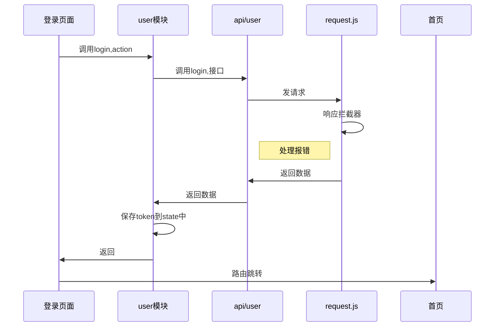

```mermaid
    sequenceDiagram
    登录页面 ->> user模块: 调用login,action
    user模块 ->> api/user: 调用login,接口
    api/user ->> request.js: 发请求
    request.js ->> request.js: 响应拦截器
    Note left of request.js : 处理报错
    request.js ->> api/user: 返回数据
    api/user ->> user模块: 返回数据
    user模块 ->> user模块: 保存token到state中
    user模块 ->> 登录页面: 返回
    登录页面 ->> 首页: 路由跳转
```